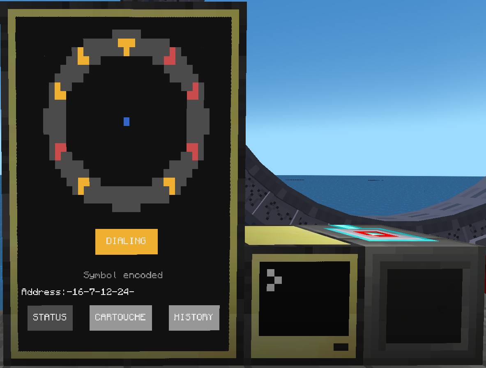

# ComputerCraft programs for the Stargate Journey Mod for Minecraft

## [MilkyWay Stargate Dialing](./MilkyWayStargateDialing.lua)
*Created by Povstalec*
 - By default works with basic interface nad milkyway stargate
 - Basic dialing
 - Predefined addresses - easily expandable
 - Two phase engage (Open / Close chevron)

## [SGC dialing](./SGCdialing.lua)
*Created by Povstalec*
 - Stargate Center like dialing
 - Three phase engage (Open / Encode / Close)§
 - Variant of [MilkyWay Stargate Dialing](./MilkyWayStargateDialing.lua)

## [Stargate Monitor](./StargateMonitor/) 
*Created by lukaskabc*  
 - Interaction via monitor
 - Stargate state
 - Dialing predefined addresses
 - Connection history

 
 

## [Window drawer test](./WIndow%20drawer%20test.lua)
*Created by Povstalec*
 - unfinished program
 - for testing purposes at this time
 - In future hopefully fancy in computer GUI

## [Danger's Dialler v2.0](./DangerDialler1.lua) 
*Created by Danger*  
**[old function names - outdated]**  
**Requires Advanced Peripherals**  
 - Command line interface for gate controlling
 - Supports iris
 - Internal address list

