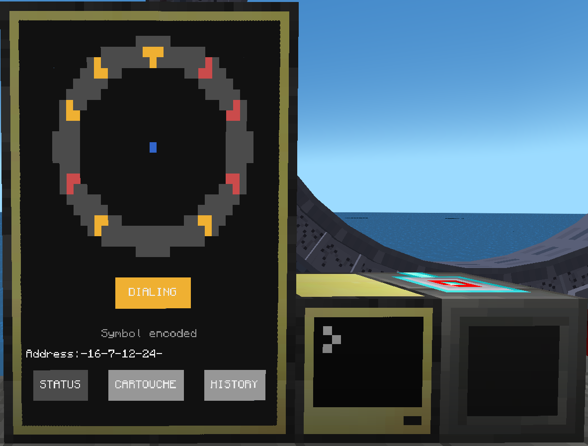

# Stargate monitor
*Created by [lukaskabc](https://lukaskabc.tk)*

Written with Stargate Journey 0.6.17 and CC:Tweaked 1.109.3 on 1.20.1  



 - Setup requires advanced computer and advanced monitor with size 2x3

 - Monitor offers 3 pages: Status, Cartouche and History

 ### Status
 - Page shows a visualisation of gate
    - Visualisation is animated with real time chevron locking (dialing via external DHD is supported)
 - Gate status: IDLE, DIALING, INCOMMING and OPEN - **Blick clicking on the status you can reset the gate - active connection is closed, encoded symbols discarded and chevron is lowered - if possible)**
    - If a computer is booted with stargate already active, 
    it will try to read its state and "guess" if the wormhole is outgoing (and so is safe to enter) or incomming (so you cannot enter), in case when computer would be unable to determine if connection is outgoing or incomming, it will fallback (fail safe) to incomming status (so you won't enter)
 - Last feedback from stargate
 - Current address - this information will vary depending on the interface used and how the address is entered.
 
**Known issues:**
 - When address is dialed too fast, gate state / visualisation may break as some computercraft events may be missed (lost)
 - When outgoing dialing is in progress and incomming connection occure
 - When gate is closed imidiately after kawoosh, it may result in some chevrons being locked on the monitor

### Cartouche
  - Address book defined in file in file 1_cartouche.lua
  - Address can be dialed by click on it's name
  - First click is select
  - Second click is confirmation that you want to dial that address

### History
 - Basically same as cartouche
 - History is persisted on each new address in file history.data
 - Addresses are resolved to names from cartouche if possible
 - All success connections are included (including outgoing and incomming connections as long as address is known)

# Installation

If you have allowed HTTP in computercraft config you can use installer
```
pastebin run hXCYLwmF
```

All files from this folder are required except `installer.lua` and `README.md`

# Setup
Program requires monitor 2 block width and 3 blocks height and any stargate interface.
By default connection to monitor is expected on left side (stargate interface may be connected via wired modem).
This connection can be customized in file `main.lua`

Cartouche can be customized in fiule `1_cartouche.lua`

## Older versions

Older versions are not supported, sorry.  
If you want to change the code, you can start by eliminating `goto` and `::continue::`  
In case you do so, your changes are welcome.  